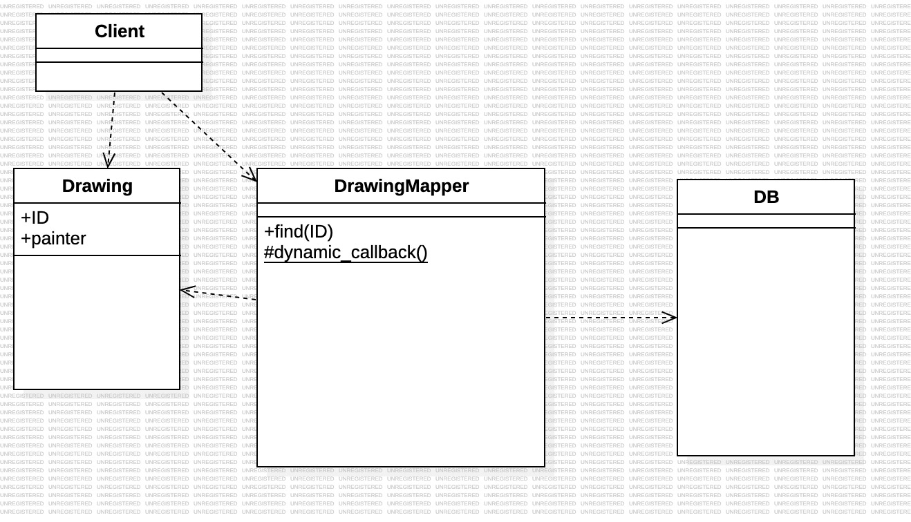
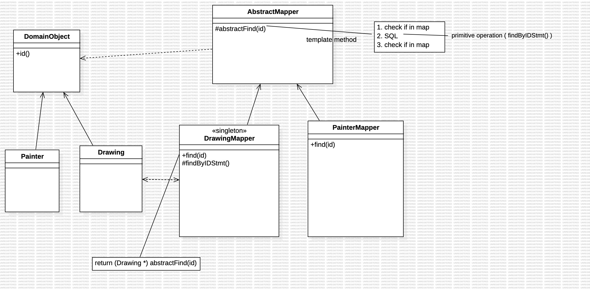
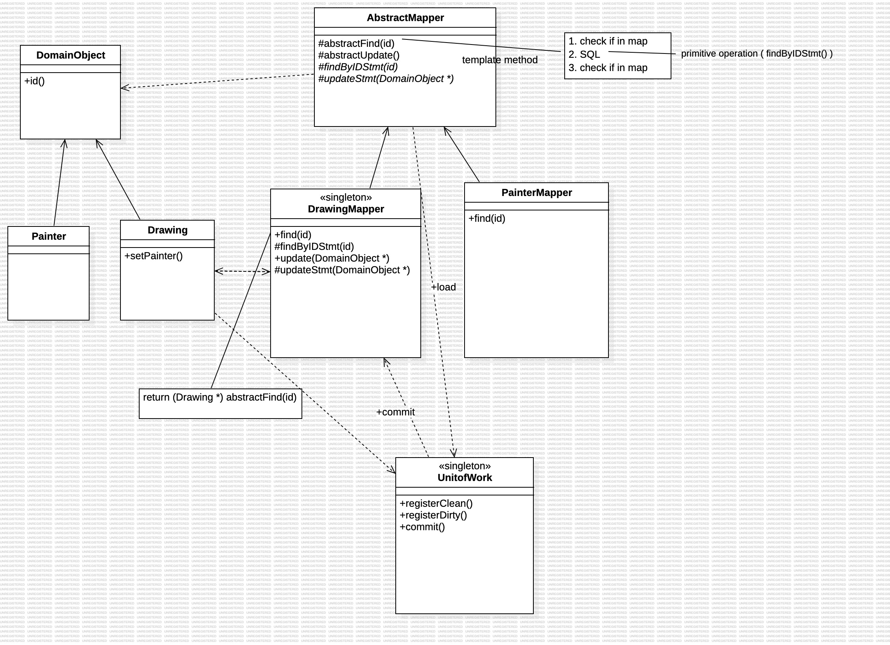

# Category
1. Object-Composite vs Class-Inheritance
* Object-Composite: Dynamic (init at run-time)
* Class-Inheritance: Static (init at compile time)
2. Structural, Creational, Behavioral

## Composite Patterns
* Tree Structure: An interface or rule provided by Composite(Node), and applied by its Component(File, Folder) 
* i.e. FileSystem -> Node, File, Folder
* Structural Pattern
* Object-Composite

## Iterator
* first(), next(), currentItem(), isDone()
* Behavioral Pattern
 
## Visitor
* accept()
* The client accepts the visitor to access the client(itself). Implementing the methods in the visitor, and calling the result from the visitor.
* i.e. 家裡(client)馬桶壞了，叫師傅(visitor)來修。
* Behavioral Pattern

## Factory Method 
* i.e. folder iterator, file iterator
* Creational Pattern
* Class Inheritance

## Builder 
* i.e. compilier parser
* Creational Pattern
* Object-Composite

## Object-Relation Mapping (ORM)
* Database handling
* DataMapper
 

 

## Singleton
* Ensure a class only has one instance (i.e. DataMapper)
* Global variable (static member in class)

## Template Method
* Base class 有一套固定的演算法, 演算法裡的某些小步驟(primetive function or hook operation)允許derived class去實作.
* Factoring the common behaviors.
* Inverted Control - parent calls child's operations.
 

 

## Unit of Work
 

 

